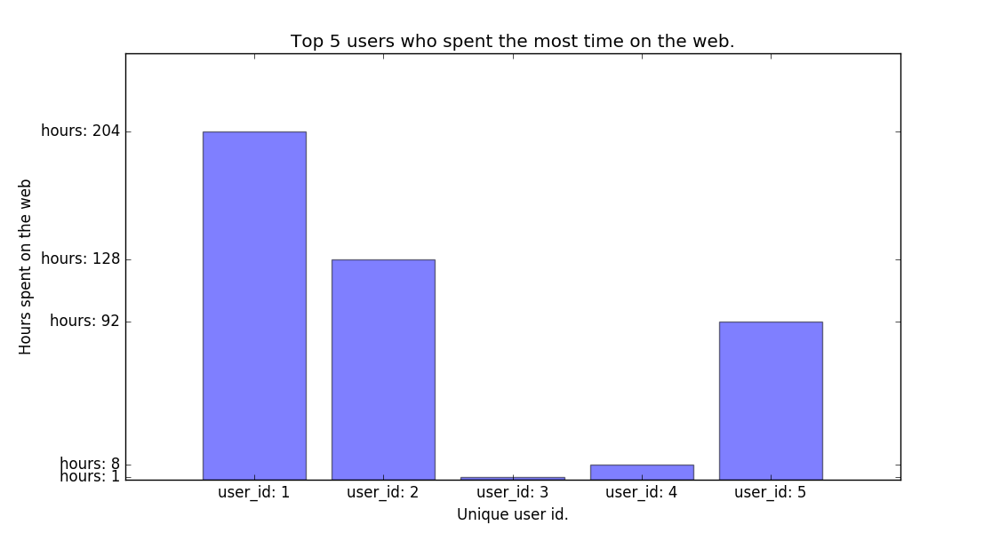

# wta_analysis
Data analysis on my wta_analytics chrome extension containing over 10k rows.

# Top 5 Time Spent
in the file `top_5_time_spent.py` I create a connection to my [web time analytics](https://github.com/seanpar203/web-time-analytics-app)
`Postgres` backend and query the database finding the top 5 users with the most amount
of hours spent on the web in descending order.

I then use `Matplotlib` to create a basic bar graph with some options and `yticks` and `xticks`
which provide some dynamic information on what is actually being displayed.

I end up with this result:

